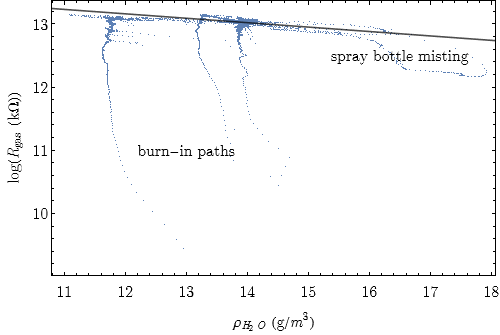

# Simplified IAQ calculation with the Bosch bme680
`raspi-bme680-iaq` implements a basic indoor air quality (IAQ) calculation using the VOC sensitive gas resistance of the Bosch BME680 sensor, circumventing the closed source Bosch [BSEC](https://www.bosch-sensortec.com/software-tools/software/bsec/) library.

The IAQ calculation as a percentage value is inspired by the example in the [pimoroni bme680 library](https://github.com/pimoroni/bme680-python), where higher percentage values represent higher air quality. In contrast, the [BSEC library](https://www.bosch-sensortec.com/software-tools/software/bsec/) returns an IAQ value between 0 and 500, where lower values represent higher air quality.

## How to use
The `IAQTracker` utilizes the bme data structure defined in the [pimoroni driver library](https://github.com/pimoroni/bme680-python). It also uses the sensor class defined therein for communication with a BME680 sensor.

On Initialization, the tracker can be handed three parameters: 

- `burn_in_cycles` defines the number of update cycles during the initial burn-in. When polling every second, the usual burn-in time of 5 minutes is equivalent to 300 cycles.

- `gas_recal_period` defines the number of update cycles after which the oldest value is dropped from the calibration list for the ceiling of the gas resistance. THis is done for compensating for long timescale drifts of the sensor.

- `ph_slope` defines the slope of the linear compensation of the logatihmic gas resistance by the present humidity. This parameter strongly depends on the heating profile and polling frequency and you may have to adapt it for your specific setup. The default value was determined experimentally by running the sensor in controlled environment (see below) and fitting the humidity-resistance plot.

The tracker is updated on every call of `getIAQ`. As long a the number of `burn_in_cycles` is not yet reached, the return-value will be of `None` type. Afterwards, it will return the IAQ value on a scale between 0 and 100.

## IAQ calculation
For IAQ calculation, the gas resistance `R_gas`, the ralative humidity `hum` and the temperatur `temp` are used from the input measurement object. The latter two are used in calculating the absolute humidity 

``hum_abs = hum * 10 * rho_max``

in g/m^3. The calculation of the maximum absolute water density

``rho_max = (6.112 * 100 * np.exp((17.62 * temp)/(243.12 + temp)))/(461.52 * (temp + 273.15))``

is derived from the [ideal gas law](https://en.wikipedia.org/wiki/Ideal_gas#Ideal_gas_law) and the [Magnus equation](https://en.wikipedia.org/wiki/Vapour_pressure_of_water#Approximation_formulas). 

Using the `hum_abs` the influence of the present water vapor concentration on the gas resistance can be compensated. The dependency appears to be exponential. Thus, the bare VOC resistance is obtained by

``comp_gas = R_gas * np.exp(ph_slope * hum_abs)``.

The air quality `AQ` is calculated as the ratio between `comp_gas` and the ceiling value `gas_ceil`, which is further squared for a steeper slope at higher air qualities and capped at 100%:

``AQ = np.minimum((comp_gas / gas_ceil)**2, 1) * 100``.

## Humidity Slope Calibration

The exact value of the slope for humidity compensation, `ph_slope`, appears to depend on the heating profile (time and temperature) as well as the polling frequency and even may vary between individual sensors. However, it is easily determined from a plot of the logarithm of the raw gas resistance `np.log(R_gas)` over the absolute humidity `hum_abs`, like shown below.

Calibration data can be aquired by measuring over some period in rooms with clean air and open windows, as well as in front of a windows or even outside. I obtained further data by spraying the surrounding air with a water spray bottle to reach into humidities close to 100%. Note, that the humidity readings of the bme680 decay only slowly and may lag behind a rapidly dropping humidity. this can be seen by the lower branch of data points for high humidities in the plot above. The value of `ph_slope` is determined from the above plot by fitting a line through all valid data points. This cen be done either manually or by linear regression.

## Physical Background
The [BME680 datasheet](https://www.bosch-sensortec.com/media/boschsensortec/downloads/datasheets/bst-bme680-ds001.pdf) states in Sec. 4.2 
> The BME680 is a metal oxide-based sensor that detects VOCs by adsorption (and subsequent oxidation/reduction) on its sensitive layer.

The sensor measures the electrical resistance of the metal-oxide surface by applying a voltage to it. Through heating the oxide layer activation energy is provided for reactions with air compounds. These reactions lead to a reduction in resistance which then can be measured.

By researching the web on such types of sensors it becomes apparent that most of them have an exponential response to the concentration of VOCs. It is most commonly tested and calibrated with ethanole vapors. Further, the response to a given type of VOC depends strongly on the specific choice of metal oxide as well as the micro-structuring of the surface (see [this article](https://iopscience.iop.org/article/10.1088/1361-6501/aa7443/meta) for a detailed review). Moreover, some sensors are also reactive towards water molecules, which is also the case for the BME680, as described later in Sec. 4.2 of the [BME680 datasheet](https://www.bosch-sensortec.com/media/boschsensortec/downloads/datasheets/bst-bme680-ds001.pdf). The choice on how to process the gas resistance readings was informed by these insights.

From the literature it also becomes apparant, that the response to different VOCs is temperature dependent. Hence, polling the BME680 at different heating profiles (which cen easily be switched by the build-in registers) could allow the extraction of further information about the air compounds. However, this would require the knowledge of the exact reaction curves (that Bosch for sure will keep secret) or access to a controlled measuring chamber.

## Remarks
This is a list of oddities and things to consider I noticed during testing the BME680. 

- In their own example, Bosch themselves use a burn-in-time of 5 minutes with polling every second, which is too short. This can be seen, when running the [bsec](https://www.bosch-sensortec.com/software-tools/software/bsec/) IAQ example on an arduino mega and keeping it still in a clean-air environment will result in the IAQ dropping to 0. 

- For compensation, BSEC does occasional re-calibrations where the baseline resistance is refreshed. These refreshes seem to happen if maesurements (like temp, hum or press) change rapidly. The manual describes this as adapting to changing environments.

- On the downside, these re-calibrations can also occur when measuring around VOC emission sources. Hence, the more slowly adapting above method is chosen. 

- Both BME280 and BME680 seem to suffer from some kind of self-heating, probably due to heat produced by resistors. Over longer measurement durations, both sensors accumulate an offset of around +1.5°C. Bosch themselves seem to not compensate for this in the [bsec](https://www.bosch-sensortec.com/software-tools/software/bsec/) example. This self-heating adds on top to the temperature offset induced by the gas sensor heating!

- In theory, the impact of the humidity on the gas resistance should depend on the heating temperature. However, I was not able to verify this in tests with alternating heating profiles.

- Using the absolute himidity results in a much better compensation than the plain relative humidity and comes much closer to what BSEC does. In fact, it can be scaled to a similar range by
``IAQ = (1 - (AQ/100)) * 500``
which allows the use of the corresponding rating scale.

- However, the IAQ curves produced by BSEC are non-linear and seem to vary in slope depending on the value of the baseline resistance.

## Requirements
- Python 3.x
- [pimoroni bme680 driver](https://github.com/pimoroni/bme680-python)
